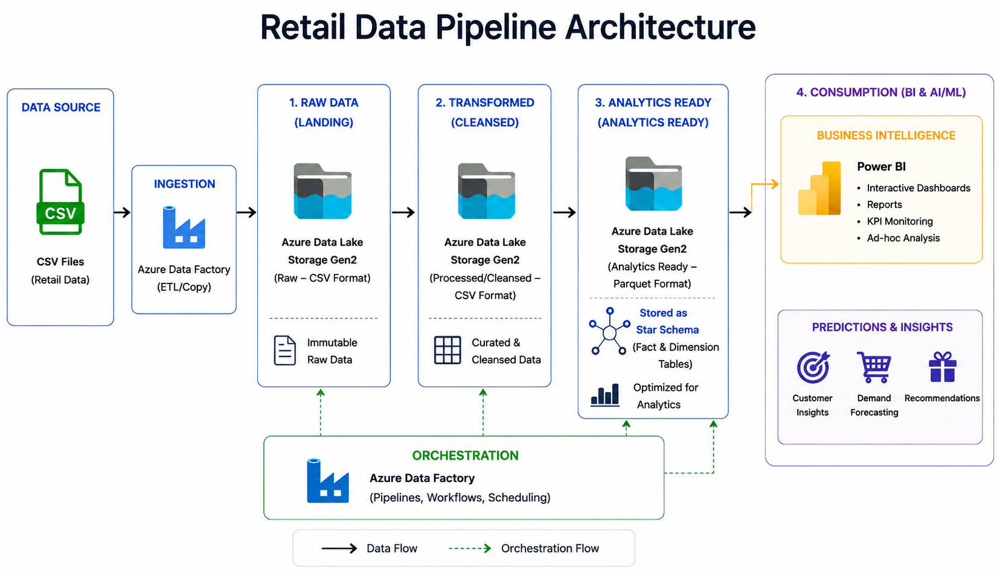
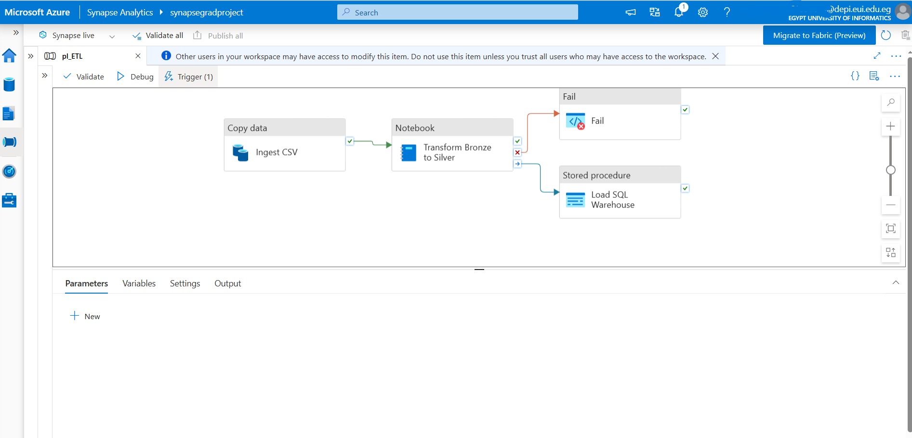

# Retail Data Engineering Pipeline on Microsoft Azure

## Overview

This project demonstrates an end-to-end cloud data engineering solution built on Microsoft Azure. The pipeline ingests raw retail data, performs cleaning and transformation using PySpark, stores analytics-ready data in Parquet format, loads a Star Schema into Azure Synapse Dedicated SQL Pool, and visualizes business insights using Power BI.

---

## Architecture

---

## Technologies

- Azure Synapse Analytics
- Azure Data Lake Storage Gen2
- PySpark
- Azure Synapse Pipelines
- Azure Synapse Dedicated SQL Pool
- SQL
- Power BI

---

## Pipeline

CSV Files

↓

Azure Data Lake (Raw)

↓

PySpark Transformation

↓

Parquet (Curated)

↓

Star Schema

↓

Power BI Dashboard

---

## Project Structure

- Notebook
- SQL Scripts
- Pipeline
- Power BI Dashboard
- Architecture

---

## Dashboard

---

## Features

- End-to-End Azure Data Pipeline
- Automated ETL using Synapse Pipelines
- Data Cleaning using PySpark
- Star Schema Data Warehouse
- Interactive Power BI Dashboard
- Parquet-based Analytics Layer
